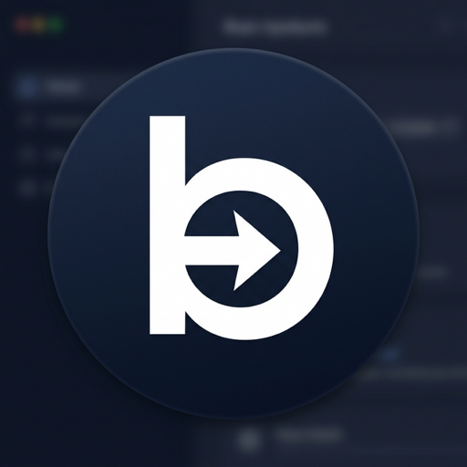
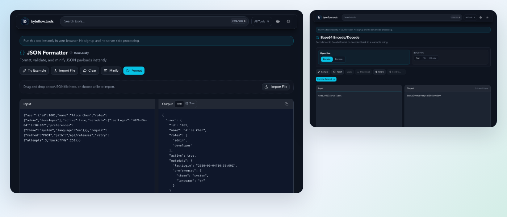

<div align="center">
  
  <h1>Byteflow</h1>
  <p><strong>Privacy-first developer tools that run in your browser.</strong></p>
  <p>120+ formatters, converters, generators, encoders, and workbench utilities for everyday engineering tasks.</p>
  <p>Built with Next.js 16, React 19, TypeScript, and Tailwind CSS 4. Static export, no server, no account.</p>

  <p>
    <a href="https://byteflow.tools"></a>
    <a href="https://github.com/baixiangcpp/byteflow.tools/actions/workflows/ci.yml"></a>
    <a href="LICENSE"></a>
    <a href="CONTRIBUTING.md"></a>
  </p>

  <p>
    <a href="https://byteflow.tools">Website</a> ·
    <a href="#why-byteflow">Why Byteflow</a> ·
    <a href="#tool-coverage">Tool Coverage</a> ·
    <a href="#quick-start">Quick Start</a> ·
    <a href="#development">Development</a> ·
    <a href="#privacy-and-security">Privacy</a> ·
    <a href="#contributing">Contributing</a> ·
    <a href="#license">License</a> ·
    <a href="#support">Support</a>
  </p>
</div>

<p align="center">
  
</p>

## Why Byteflow

Developers often need to inspect JSON, decode JWTs, format SQL, generate UUIDs, convert text, or validate data that should not be pasted into an opaque third-party service. Byteflow is built around a simple operating model: most tool payloads are processed locally in the browser, external-request tools are labeled, and the app ships as a static export.

- Browser-local tool inputs and outputs stay in your browser.
- Tools that need a user-triggered network request are labeled before use.
- No account, upload, workspace, database, or tool-processing API.
- Free to use, self-host, and contribute to under MIT.
- Static hosting friendly through Next.js export.
- Installable PWA; core app shell assets are cached for offline use.
- Seven locales: `en`, `zh-CN`, `zh-TW`, `ja`, `ko`, `de`, and `fr`.

## Tool Coverage

Popular tools include:

- [JSON Formatter](https://byteflow.tools/en/json-formatter) for formatting, validating, and minifying JSON.
- [Base64 Encode/Decode](https://byteflow.tools/en/base64-encode-decode) for text and Base64 conversion.
- [JWT Decoder](https://byteflow.tools/en/jwt-decoder) for inspecting token headers and payloads.
- [Hash Generator](https://byteflow.tools/en/hash-generator) for MD5, SHA-256, and SHA-512 hashes.
- [URL Encode/Decode](https://byteflow.tools/en/url-encode-decode) for safe URL component conversion.
- [UUID Generator](https://byteflow.tools/en/uuid-generator) for UUID v4 and v7 generation.
- [Crontab Generator](https://byteflow.tools/en/crontab-generator) for building and explaining cron expressions.
- [Regex Tester](https://byteflow.tools/en/regex-tester) for testing regular expressions.
- [JSON to TypeScript](https://byteflow.tools/en/json-to-typescript) for deriving TypeScript types from JSON.

Browse the full catalog at [byteflow.tools/en/all-tools](https://byteflow.tools/en/all-tools).

## Quick Start

Use the hosted app at [byteflow.tools](https://byteflow.tools), or run it locally:

```bash
git clone https://github.com/baixiangcpp/byteflow.tools.git
cd byteflow.tools
npm install
npm run dev
```

Open [http://localhost:3000](http://localhost:3000).

Prerequisites:

- Node.js 20.19.0 or newer within Node 20.x
- npm 10.x

The repository includes `.nvmrc` and `package.json` engine metadata. Environment variables are optional for local development; see [.env.example](.env.example) for the supported keys.

## Development

The package is marked `private` to avoid accidental npm publishes; the source is MIT-licensed and free to self-host. CI gates cover registry generation, i18n, PWA manifests, sitemap data, security headers, static export metadata, and smoke flows.

| Command | Purpose |
| --- | --- |
| `npm run dev` | Start the local Next.js dev server. |
| `npm run lint` | Run ESLint. |
| `npm run test` | Run Vitest unit, component, and guard tests. |
| `npm run check:types` | Run TypeScript without emitting files. |
| `npm run validate` | Run pre-build gates for service worker, sitemap, security headers, PWA, i18n, generated registry, and types. |
| `npm run build` | Run validation, static export build, and post-build route/export checks. |
| `npm run test:e2e:smoke` | Run the Playwright smoke test against the built app. |
| `node scripts/e2e/capture-readme-demo.js --start-server` | Regenerate the README demo image in `public/screenshots/`. |
| `npm run create:tool` | Scaffold a new tool route, feature module, manifest, and translations. |

Generated registry files are checked in because runtime and CI consume them:

```bash
npm run generate:tool-index
npm run check:tool-index
npm run generate:client-tool-lookup
npm run check:client-tool-lookup
```

Do not edit files under `src/generated/` by hand.

## Project Structure

- `src/app/[lang]/` contains locale-aware routes and thin tool wrappers.
- `src/features/tools/` contains tool-specific feature modules.
- `src/core/` contains shared runtime infrastructure, registry, i18n, SEO, storage, and utilities.
- `src/generated/` contains checked-in generated registry artifacts.
- `scripts/` contains generators, CI gates, post-processing, smoke automation, and scaffolding.
- `tests/` contains unit, component, e2e, and structural guard coverage.

Durable architecture references:

- [Directory structure](docs/architecture/directory-structure.md)
- [Module boundaries](docs/architecture/module-boundaries.md)
- [System architecture](docs/architecture/system-architecture.md)
- [Design system](docs/specs/design-system.md)

## Adding Tools

Use `npm run create:tool` when possible, then follow [CONTRIBUTING.md](CONTRIBUTING.md) for manifests, route wrappers, translations, registry generation, and test expectations.

## Privacy and Security

Byteflow's core tools are designed to process payloads in the browser. Tools marked External request disclose when a network lookup is needed. Avoid sharing real secrets, production tokens, private customer data, or sensitive payloads in public issues, screenshots, logs, or reproduction cases.

Report vulnerabilities through the process in [SECURITY.md](SECURITY.md).

## Contributing

Contributions are welcome when they preserve the local-first privacy model and the guarded architecture boundaries. Start with [CONTRIBUTING.md](CONTRIBUTING.md), follow the [Code of Conduct](CODE_OF_CONDUCT.md), and use the issue templates for bug reports or feature requests.

Before opening a pull request, run the checks that match your change. For user-facing, registry, i18n, or build-surface changes, run:

```bash
npm run lint
npm run test
npm run validate
npm run build
```

## License

Byteflow is released under the [MIT License](LICENSE).

## Support

- Issues: [github.com/baixiangcpp/byteflow.tools/issues](https://github.com/baixiangcpp/byteflow.tools/issues)
- Security: [SECURITY.md](SECURITY.md)
- Changelog: [CHANGELOG.md](CHANGELOG.md)
- Website: [byteflow.tools](https://byteflow.tools)
